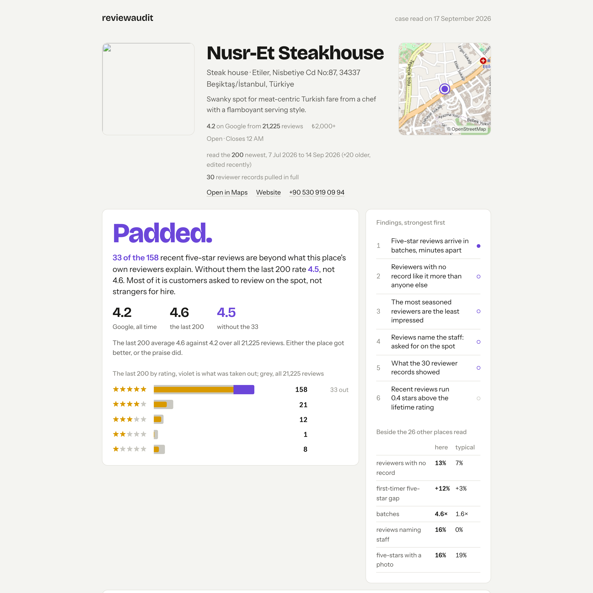
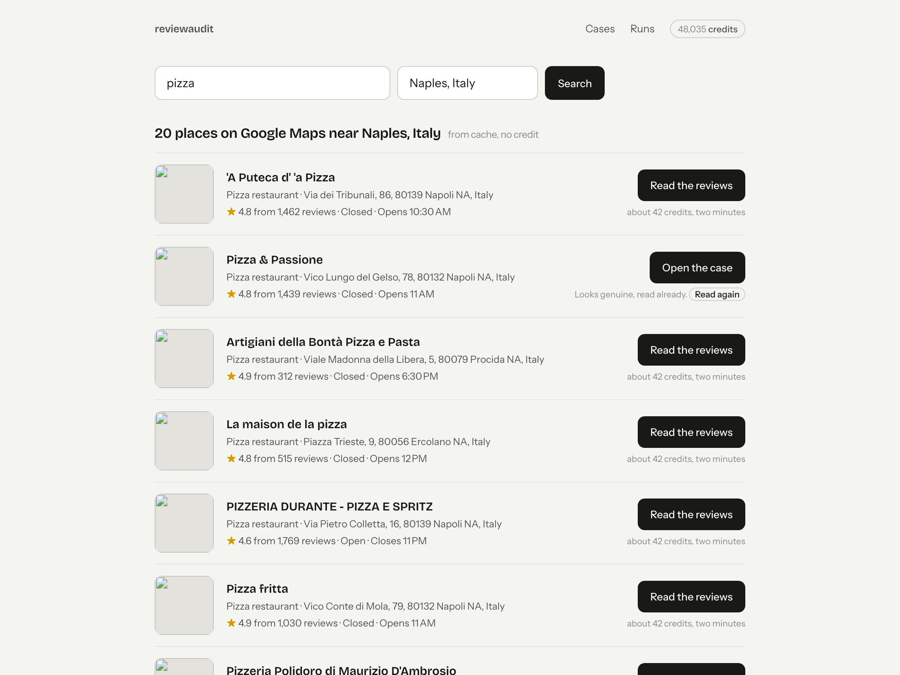
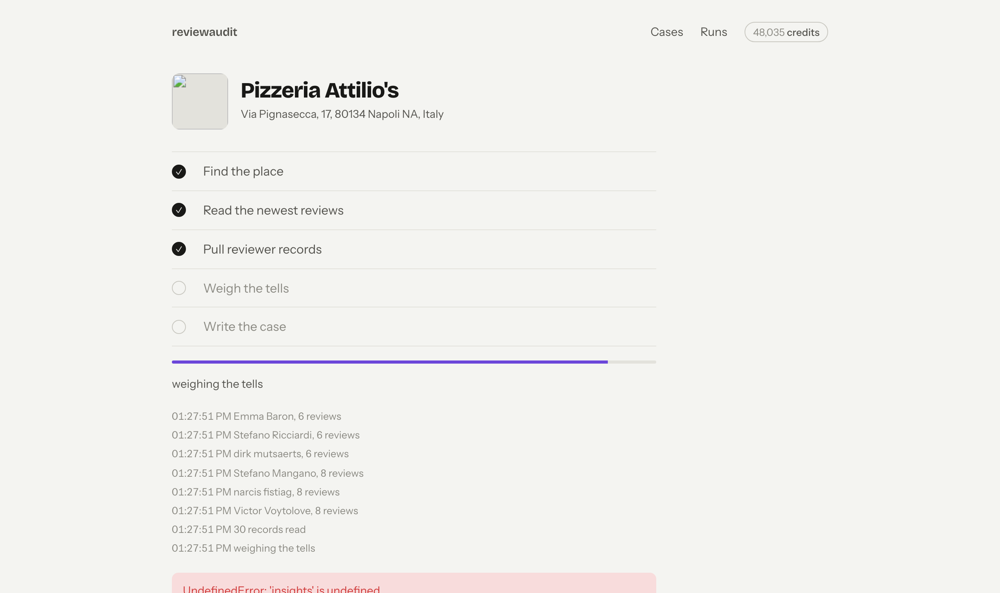
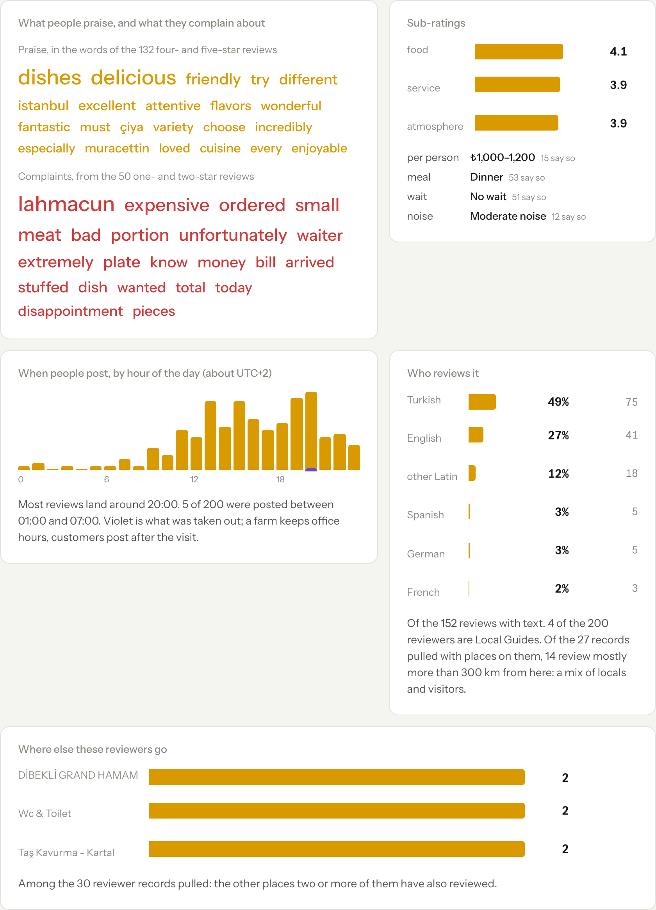
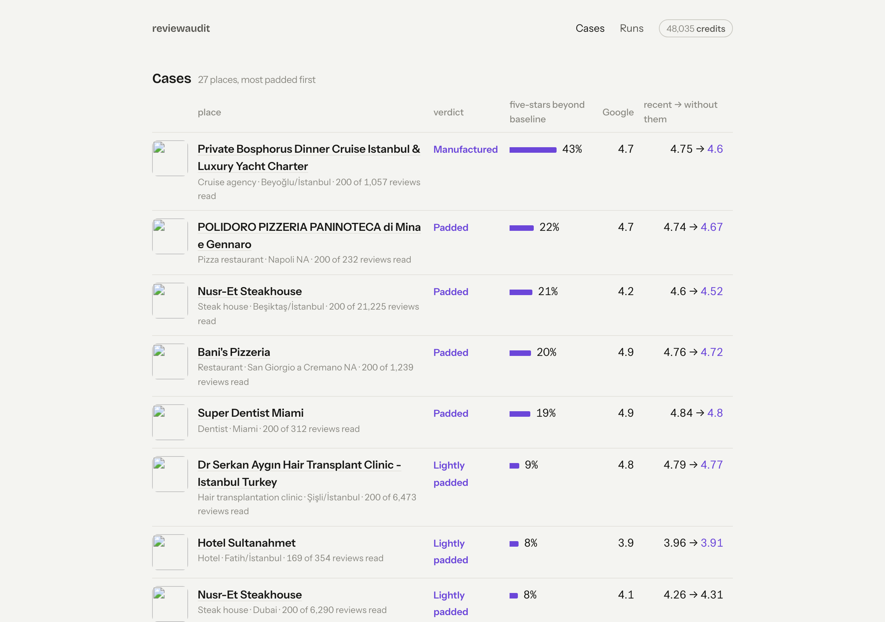

<p align="center"></p>

# reviewaudit

**Is this 4.8 real?** Give reviewaudit a place on Google Maps. It reads the newest reviews
through [SerpApi](https://serpapi.com), pulls the full records of the reviewers worth a
look, and writes one page that says how much of the praise the place's own reviewers can
explain, which reviews don't add up, and what kind of padding it is: bought, or asked for
at the table.

It runs on your machine with your SerpApi key. A place costs about 42 credits and two
minutes; the free plan's 250 a month reads five places.

## Quick start

```sh
uv tool install git+https://github.com/zcag/reviewaudit     # or: pipx install git+https://github.com/zcag/reviewaudit
reviewaudit serve                                            # opens http://localhost:8811
```

Paste your key from [serpapi.com/manage-api-key](https://serpapi.com/manage-api-key) when
the app asks (it is saved to `~/.reviewaudit/config.json`, readable by you only; `SERPAPI_KEY`
in the environment works too), search for a place, click *Read the reviews*, watch it run,
open the case.

The same read from the terminal:

```sh
export SERPAPI_KEY=…
reviewaudit "Nusr-Et Steakhouse Etiler"        # → ~/.reviewaudit/reports/nusr-et-steakhouse-besiktas-istanbul.html
reviewaudit 0x14cab61013b1d78b:0xc36794433940ac13 --reviews 400 --lookups 50
reviewaudit --norms                            # rebuild the "beside other places" baseline from your own cases
```

## What you get

<p align="center"></p>

Search Google Maps for the place (one credit; repeated searches are free, everything is
cached), pick it from the results, and follow the read stage by stage:

<p align="center"></p>
<p align="center"></p>

Every place becomes a case: a verdict, the three ratings (Google's all-time, the last 200,
and the last 200 without the reviews taken out), the last 200 by stars against the lifetime
distribution, findings in order of strength with the chart or table that proves each one,
every review on a timeline, what was ruled out, and the reviews taken out with links back to
Google. One self-contained HTML file per place, light and dark, with Open Graph tags so a
pasted link previews properly.

Below the audit, the same reviews read as reviews: what people praise and what they
complain about (words that lean five-star against one-star), Google's own review topics,
sub-ratings for food, service and atmosphere (or rooms and location) with and without the
reviews taken out, what people recommend ordering, the hour of day reviews are posted (a
farm keeps office hours), the language mix and how far the reviewers' other reviews sit from
here, where else they go, how fast the owner replies and to whom, and the reviews other
people found most useful.

<p align="center"></p>
<p align="center"></p>

## How it reads a place

Three SerpApi engines, about 42 calls:

1. [`google_maps`](https://serpapi.com/google-maps-api) finds the place: its `data_id`,
   photo, description, opening hours, and Google's lifetime star counts.
2. [`google_maps_reviews`](https://serpapi.com/google-maps-reviews-api), newest first,
   20 a page. Each review carries the reviewer's lifetime review count, Local Guide status,
   photos and an ISO timestamp.
3. [`google_maps_contributor_reviews`](https://serpapi.com/google-maps-contributor-reviews-api)
   for the 30 reviewers most worth a closer look: everything the account has ever reviewed,
   with the place behind each rating.

Every response is cached under `~/.reviewaudit/cache`, so re-reading a place or rebuilding a
report costs nothing.

## What it looks for

Account tells (`only review`, `thin account`, `rating only`) never condemn a review on
their own; they rank. What gets taken out is only what the place's own baseline cannot
explain:

- **Reviewers with no record like it more than anyone else.** Five-stars from first-time
  accounts beyond the rate that accounts with 4 to 50 reviews give the *same* place.
- **A week carried far more five-star reviews than this place gets.** A week's count minus
  the sample's median week (Poisson tail below 0.001, at least 2.5×).
- **Five-star reviews arrive in batches, minutes apart.** Pairs posted within ten minutes,
  beyond what the hours people post at predict, so a lunch rush is not a batch.
- **Reviews that say the same thing in the same words.** Texts sharing half their
  three-word phrases.
- **A group of accounts keeps reviewing the same places.** Three or more checked accounts
  that pairwise share other places. Two is a couple on holiday.

Two more tells say what *kind* of padding it is rather than how much. Reviews that name a
member of staff ("Dalyan bey", "our waiter Gökmen", "Dr Asil") are the mark of a review
asked for on the spot; pairs minutes apart that share a surname are one party counted twice.
The verdict says which dominates: customers asked at the table, or strangers for hire.

Each review's suspicion is the noisy-OR of its tells' weights, discounted by traits that
cost effort to fake (Local Guide, photos, long text, a deep record). The weights live in
`signals.py` and are printed at the bottom of every case.

Every case also shows the place beside every other place reviewaudit has read: reviewers with
no record, the first-timer gap, batches, staff named, photos. reviewaudit ships with the
baseline from its first 19 places across nine cities; once you have read eight of your
own, `reviewaudit --norms` (or any run in the app) replaces it with yours.

## Where it is blind

Printed on every case, because they matter:

- A place where everyone gives five stars looks the same whether they mean it or not. The
  gradient across account depth is the evidence; a flat 95% is not.
- A first review at a famous place is normal. A thin account alone never counts; only the
  excess over the place's own baseline does.
- Two accounts that share other places are usually a couple. Rings need three.
- "Newest first" still surfaces old reviews edited recently; they are shown but kept off
  the axis.
- Hotels on Maps carry Tripadvisor and Trip.com reviews with no account behind them; they
  are left out and the page says how many.

## Notes for SerpApi users

- `google_maps_reviews` pages asked for with `next_page_token` and `num=20` sometimes come
  back empty with `Success`, and SerpApi caches that answer for an hour. `api.py` retries
  with `no_cache=true`, then falls back to `num=10`.
- The contributor engine returns relative dates only ("a week ago"); the reviews engine has
  `iso_date`. Burst and batch tells therefore run on the place's reviews, and the
  contributor record is used for what an account has reviewed, not when.
- `user.reviews` on a review counts written reviews; the full record adds rating-only
  entries, so a "1 review" account can have 19 ratings. The record overrides the tag.

## Development

```sh
git clone https://github.com/zcag/reviewaudit && cd reviewaudit
uv sync
uv run pytest                 # the tells on synthetic data, the app's routes
uv run reviewaudit serve          # the app, reloading templates on each request
```

`tools/overflow.js`, pasted into the console on the cases page, loads every case at five
widths and lists anything that leaks out of its card. `tools/screenshots.py` retakes the
images in `docs/` against a running app (Playwright, fixed viewport, light theme).
`REVIEWAUDIT_HOME` moves the data directory.

```
src/reviewaudit/api.py        cached SerpApi calls, pagination, the empty-page retry
src/reviewaudit/signals.py    the tells, the baseline excess, suspect selection
src/reviewaudit/case.py       findings with evidence, what was ruled out, the nature of the padding
src/reviewaudit/core.py       one place end to end, with progress
src/reviewaudit/report.py     chart geometry (timeline swarm, bars, map tile), rendering
src/reviewaudit/web.py        the app: search, runs, cases
src/reviewaudit/templates/    the case page, the app pages, one stylesheet
```

## License

MIT.
